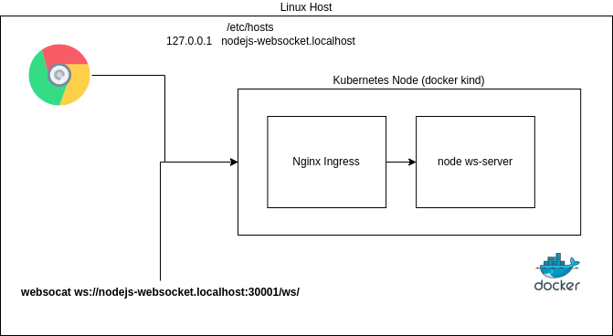

## About the project

This project configures

- A working setup thats exposes a websocket server (nodejs) through Kubernetes nginx-ingress controller
- Uses kind (kubernetes in docker setup)
- A makefile can run various setup scripts

## Overview

The following diagram illustrates the setup.

 

A client (browser or websocat) can connect to the nodejs websocket server externally into the kubernetes cluster.
The external to internal traffic is passed through nginx ingress controller.

## Prereqs

You need the following

- A linux host (This was tested on a Ubuntu 20.04 host)
- Docker Daemon (https://docs.docker.com/engine/install/)
- Kind utility (https://kind.sigs.k8s.io/)
- Kubectl (https://kubernetes.io/docs/tasks/tools/)
- Make, Bash
- websocat, https://github.com/vi/websocat

## Getting started

If you have all prereqs above you can run make to setup the environment

```bash
make 
```

But must importantly, first open the Makefile and check how it works...

## Notes

The makefile will add a host entry into your /etc/hosts. It requires you to perform sudo, thus entering your password.

TCP traffic from the host to the nginx ingress pod will be available by using the following NAT configurations

    - From Host to the Kind Kubernetes Nodes (Docker port-mapping in kind, See ./scripts/kind-cluster-config.yaml)
    - From Kind Kubernetes Node to the Ingress Service (Kubernetes NodePort, See ./manifests/service.yaml)

DNS resolution from the host to the pod is made available by the following configurations

    - From Host to the Kind Kubernetes Node (Adding a host entry to /etc/hosts that points to the Kubernetes Node Port Mapping)
    - From Kind Kubernetes Node to Nginx ingress (The ingress will have the Host address, so it can forward HTTP requests)

## Common issues

* If labels are incorrect between Deployment and Service and Ingress. This may lead to Endpoints not being populated.
* Ingress path doesnt match the server path in the server.js
* Port mappings are incorrect all the way from Host -> Kubernetes Node -> Ingress Service (NodePort) -> Nodejs service ports -> Container ports
* HTTP error code 426, "Upgrade Required"
When connection you may get this, this was resolved by annotating the ingress manifest with "nginx.org/websocket-services: "nodejs-websocket-service"
* Your ingress notation may not match your Kubernetes version (networking.k8s.io/v1 vs extensions/v1beta1)

## References

* nginx/kubernetes-ingress, WebSocket support in v2.4.1: https://github.com/nginxinc/kubernetes-ingress/tree/v2.4.1/examples/ingress-resources/websocket
* ingress gist for websocket, https://gist.github.com/jsdevtom/7045c03c021ce46b08cb3f41db0d76da#file-ingress-service-yaml.  This didn't work in this configuration. It uses the older ingress syntax.
* https://www.digitalocean.com/community/questions/how-to-solve-nginx-websocket-secure-wss-error-426-upgrade-required
* https://serverfault.com/questions/1015277/how-to-solve-nginx-websocket-secure-wss-error-426-upgrade-required
* https://www.civo.com/learn/using-websockets-with-ingress-controller (March 2021)


